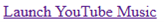

User-Initiated Installation of a Web Application
===============================

A Problem
---------

Today, the process of distributing and acquiring web applications is both fragmented and limited in capability. Each user agent has created a set of entry points, some more discoverable and intuitive than others. Furthermore, because installation is limited to the current page only, developers and users must jump through even more hoops to create a functional acquisition pipeline for other sites.

The Proposal
----------

A declarative `<install>` element that renders a button whose content and presentation is controlled by the user agent. Similar to other [permission elements][pepc] (e.g. [`<geolocation>`][geolocation]), the user agent's control over (and therefore _understanding of_) the element's content means that it can make plausible assumptions about a user's contextual intent. Users who click on a button labeled "Install 'Wonderful Application'" are unlikely to be surprised if an installation prompt for exactly that application appears, and they'll be primed to make a good decision about the question such a prompt presents.

## The Design

### Element content

The element renders standardized text and iconography controlled by the user agent, such as:

<br>

### Element attributes

`installurl` specifies the document to install. If unspecified, the current site will be installed.

`manifestid` specifies the computed id of the document to install. If unspecified, the manifest referenced by the document at `installurl` must have a custom id defined. If specified, it must match the computed id of the site to be installed.

```html
<install installurl="https://music.youtube.com/"
         manifestid="https://music.youtube.com/?source=pwa">
  [Fallback content goes here.]
</install>
```

#### Other valid element usages
```html
<!-- Install the current page. -->
<install></install>

<!-- The manifest file at installurl should contain an id. -->
<install installurl="https://reddit.com/">
</install>
```

### Element behavior

On click, the user agent can initiate their existing installation flow, such as showing a confirmation prompt:


### Element fallback content

If the user agent doesn't support installation, present a simple link:



```html
  <install installurl="https://music.youtube.com/"
           manifestid="https://music.youtube.com/?source=pwa">
    <a href="https://music.youtube.com/" target="_blank">
      Launch YouTube Music
    </a>
  </install>
```

### What if the app is already installed?

The user agent can transform the element into a simple 'Launch'-style button, a highly requested feature from web developers. When clicked, it should follow existing launch protocols.


User agents must take care with side channels such as width, as developers must not be able to detect the change in the element's content to avoid fingerprinting concerns.

## Error handling / debuggability

The element offers event-driven hooks allowing developers to understand users' interactions, reusing [`InPagePermissionMixin`][mixin] concepts like `promptaction`, `promptdismiss`, and `validationstatuschange` events, `isValid` and `invalidReason` attributes, etc. Additional events will be needed for failures related to manifest fetching/parsing.

Validation errors could include violations of the generally applicable [presentation restrictions][security] for permission elements, as well as data validation errors when processing the referenced manifest.

That said, developers wouldn't actually need to hook into any of those attributes for the simplest
cases: `<install></install>` and `<install installurl="..."></install>` would be sufficient for straightforward use cases of offering installation.

[pepc]: https://github.com/WICG/PEPC/
[geolocation]: https://github.com/WICG/PEPC/blob/main/geolocation_explainer.md
[mixin]: https://wicg.github.io/PEPC/permission-elements.html#permission-mixin
[security]: https://github.com/WICG/PEPC/blob/main/explainer.md#security-abuse

Design considerations
--------------

### Install by manifesturl?

Should the `installurl` attribute be supplemented with, or even replaced by, a `manifesturl` attribute? e.g. https://youtube.com/manifest.webmanifest

Issue - [Specifying manifests vs documents](https://github.com/WICG/install-element/issues/5#issuecomment-3613279651)

Functionally, installing from a manifest file directly avoids the overhead of loading the document at `installurl` in the background, and makes it more feasible to render custom information in the button. It also reduces complexity around manifest id requirements, as the manifest file is the source of truth for an app's identity. However, it introduces a variety of additional concerns -

* **Preventing manifest spoofing** - Manifests are not required to be served from the same origin as the site (e.g. CDN). To avoid spoofing, we'd need to load `start_url` in the background, and verify its manifest matches the provided attribute value. Alternatively, we could require that manifests be on the same origin.
* **Service worker registration** - Presently, service workers are registered on page load, and the manifest file does not contain a static reference to the service worker. One possibility is requiring a `serviceworker` field in the manifest. Alternatively, if the user agent chooses to launch the app immediately after installation, that may be sufficient as the service worker would be registered on page load.
* **Stale manifest urls** - Generally, manifest urls seem more likely to change than installurls. To avoid stale manifests, developers would need to periodically query the HTML.
* **Manifest Parsing** - We can parse the manifest by setting the `documentUrl` as the origin of the `manifesturl`, but we'll likely need to change the manifest spec more.

Realistically we need developers to tell us what they want/need here. (In fact, we've already received [feedback](https://github.com/WICG/install-element/issues/1) that supporting both is desirable.) In the meantime, our proposal remains to start out with `installurl` and `manifestid` to begin gathering feedback, and allow time to continue iterating on these considerations.

### Should manifest id be required?

Issue - [Should we require manifestid](https://github.com/WICG/install-element/issues/6)

Under the current install by `installurl` proposal, the `manifestid` attribute is optional. However, if the developer does not provide this attribute, then `installurl` must point to a manifest file with an `id` field.

Our guiding principle here is if the developer is not required to provide a manifest id, the user agent must always fetch the install url, then the manifest. This will likely fall out of the decisions around what url we use to install.

### Custom Information in Button

Rendering the app name, origin, or icon in the install element would provide an even stronger signal of user intent, but also introduces a variety of complications, such as:
- **Performance:** When and how to get the information to show in the button
- **UX:** Introduce a two-tap flow? (tap 1 loads information, tap 2 installs)
- **Security:** Long app names. See [handling very long app names](#what-if-this-is-an-app-for-a-donaudampfschifffahrtsgesellschaftskapitän).
- **Styling/Accessibility:** App icon contrast ratio. Button layout/width.

If user agents wish to include custom information, they should take these into consideration.

It's also worth noting that the button's exact rendering may eventually be useful ambiguity, as it would allow each user agent to decide what information they need, and how to mitigate the concerns outlined above.

### Potential Additional Attributes

- `manifesturl`: Link to the manifest file
- `includeicon`: If specified, fetches and renders the app's icon (in addition to the install icon)

Please give me some IDL and technical detail!
--------------------------------------------------

Ok. Here you go:

```
[Exposed=Window]
interface HTMLInstallElement : HTMLElement {
  [HTMLConstructor] constructor();

  [CEReactions, ReflectURL] attribute USVString installurl;
  [CEReactions] attribute USVString manifestid;
};
HTMLInstallElement implements InPagePermissionMixin;
```

The [`InPagePermissionMixin`][mixin] is defined as part of the general Permission
Element proposal, and includes a few attributes and events. We'll reuse those here
for consistency.

* `isValid` will return a boolean: `true` if the element's presentation makes it a valid click
  target for users (because the user agent has confidence that it's visible and comprehensible,
  and that it's been in that state long enough to be reasonably reliably viewed and comprehended),
  `false` otherwise.

* `invalidReason` will return an enum specifying the reason the element is considered invalid,
  including invalidity of the element's underlying data (for cases in which the URL is missing 
  or invalid, or manifest fetching/parsing fails).

* `initialPermissionStatus` and `permissionStatus` will reflect the state of the `install` feature
  (which we'll define somewhere as a policy-controlled feature with a default allowlist of
  `'self'`).

* `promptaction` events will be fired when the user finishes interacting with any installation
  prompt triggered by activating the element.

* Likewise, `promptdismiss` will be fired when users cancel or dismiss the installation prompt.

* `validationstatuschange` events fire when the validation status changes (crazy, right?).

The element's [activation behavior][activation behavior] is quite similar to other permission
elements (e.g. [`<geolocation>`'s activation behavior][activate-geo]): we'll check to see whether
the event is trustworthy, the element is valid, permission to `install` is available and so on.
Then we'll trigger an installation prompt in an implementation defined way. This will result in
the user making some decision, leading to either a `promptdismiss` or `promptaction` event firing
on the element.

The element hooks directly into the backend of navigator.install. When clicked, it will 
load the `installurl` in the background to obtain the web application manifest and related 
resources needed for the installation dialog. The steps here will be similar to those defined 
for [the "manifest" link type][manifest-fetch], fetching and processing the manifest according 
to its [processing steps][manifest-process]. If we get a valid manifest back, the installation 
dialog is presented. If not, an error event is fired and the `<install>` element reports the 
error appropriately.

[activation behavior]: https://dom.spec.whatwg.org/#eventtarget-activation-behavior
[activate-geo]: https://wicg.github.io/PEPC/permission-elements.html#ref-for-dom-inpagepermissionmixin-features-slot%E2%91%A1%E2%93%AA
[manifest-fetch]: https://html.spec.whatwg.org/multipage/links.html#link-type-manifest:linked-resource-fetch-setup-steps
[manifest-process]: https://html.spec.whatwg.org/multipage/links.html#link-type-manifest:process-the-linked-resource

Security & Privacy
------------------

* We don't generally consider the act of installation to be a security boundary today, though there
  are capabilities that we only offer to installed applications (often around integration with the
  native OS, ranging from `file_handlers` to homescreen icons), and some forms of friction that
  some user agents reduce when applications are installed (notifications, badging, etc). It seems
  likely to me that an imperative version of this capability will create some of the same incentives
  for abuse that we've seen with notifications, which suggests that raising the bar for triggering
  an installation prompt might be reasonable. This proposal does so in a way that seems to provide
  additional confidence that the user actually wants to install something, and does so in a way that
  seems relatively lightweight.

* Cross-origin installation requires us to talk about one origin in the context of another. This is
  somewhat difficult to do effectively.

* The user-facing benefits claimed above depend entirely on the truth of the claim that users do see
  and understand the element's representation. This means both that user agents need to do
  appropriate research to ensure the pixels they present in the element are in fact reasonably
  comprehensible, _and_ evaluate their installation flows to ensure that they set user expectations
  correctly.

* Sites which wish to ensure that users can only install their applications from their own origin
  can do so by examining Fetch Metadata headers in the incoming request for a given manifest and
  handle things appropriately in the case that `Sec-Fetch-Dest` is `manifest`, but `Sec-Fetch-Site`
  is not `same-origin`.

### What if this is an app for a [Donaudampfschifffahrtsgesellschaftskapitän][german]?

User agents will need to consider how to handle very long words, including appropriate resizing, eliding, and truncation logic (similar to what the installation dialog already implements). User agents should apply the same considerations they use [elsewhere][url-display] for displaying origins and names.

[german]: https://en.wiktionary.org/wiki/Donaudampfschifffahrtsgesellschaftskapit%C3%A4n
[url-display]: https://chromium.googlesource.com/chromium/src/+/HEAD/docs/security/url_display_guidelines/url_display_guidelines.md

Open Questions
------------

### Will this work with WebXR/WebGL scenarios?

No, this is a known limitation of the element proposal.

### Are iFrames supported?

No, for security reasons this should be restricted to top level browsing contexts.

Alternatives
------------
* [Web Install API][api]
* Given that the behavior discussed above would support both installation and launching, depending
  on the application's installed state, some more generic name might be appropriate. `<pwa>` or
  `<webapp>` could more broadly describe a potential range of behavior. `<install>` seems preferrable, as launching seems like it's really just a privacy-preserving mechanism to align behavior without
  revealing installation state, but another broader name could certainly be viable.

[api]: https://github.com/MicrosoftEdge/MSEdgeExplainers/blob/main/WebInstall/explainer.md